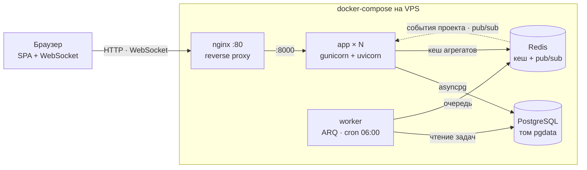
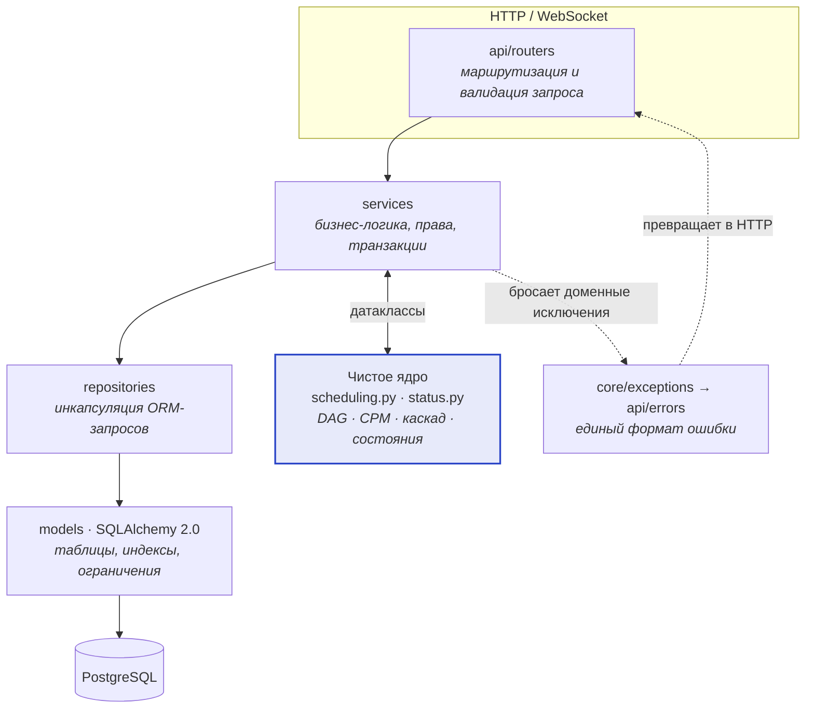
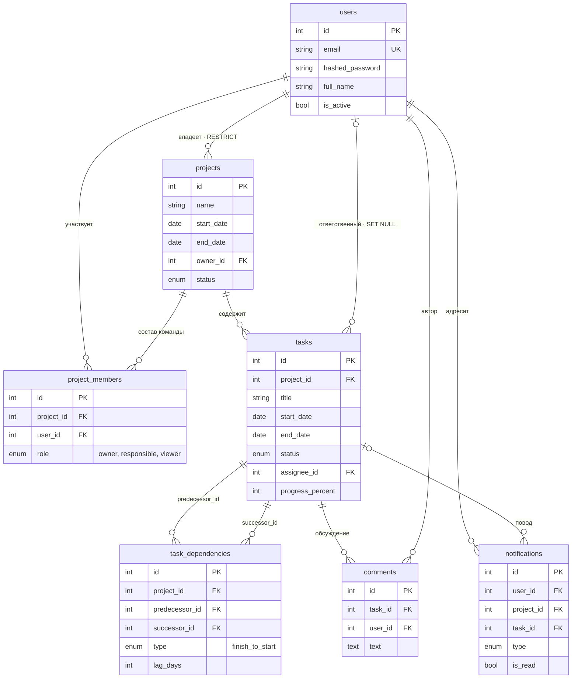
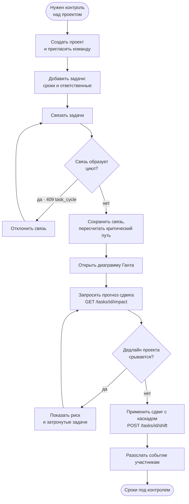
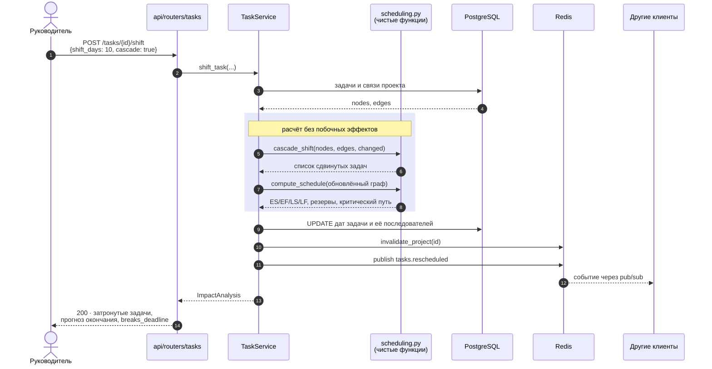
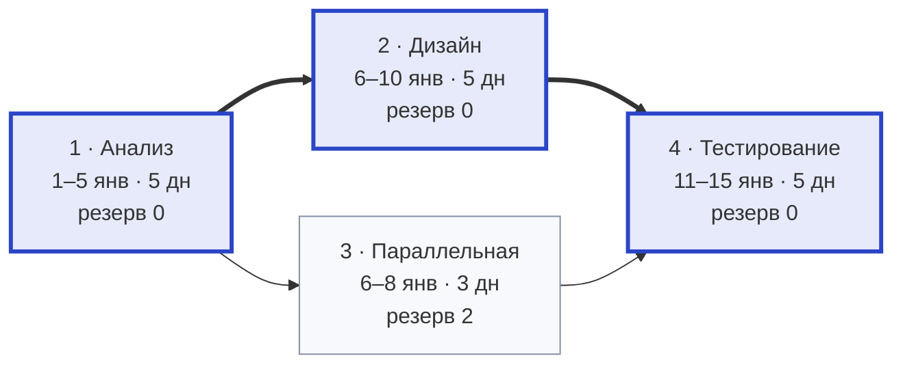
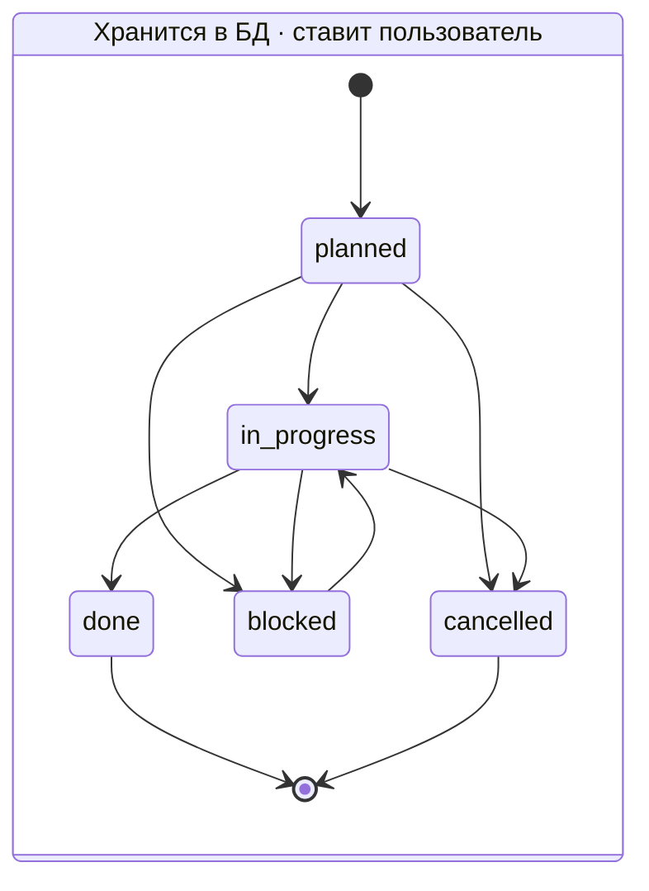
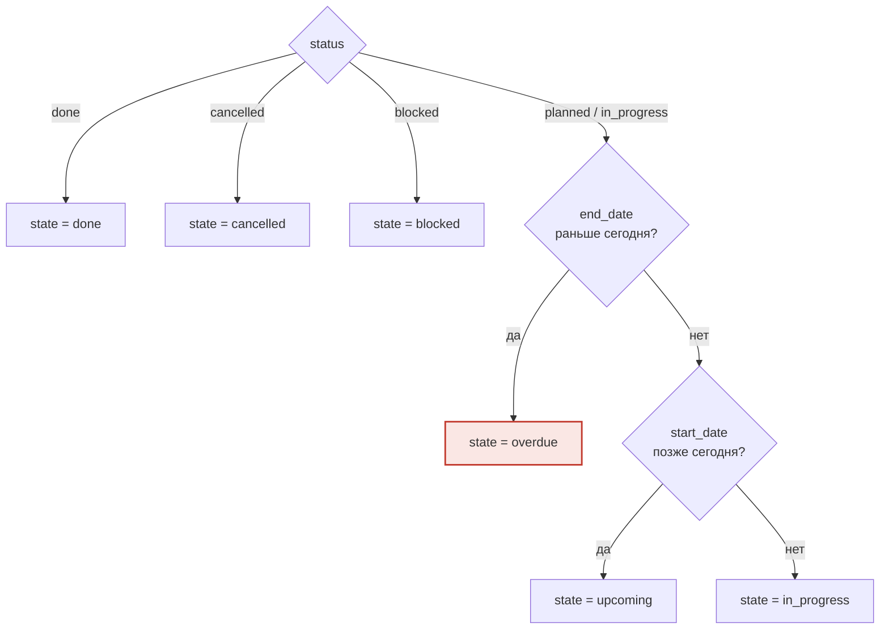

# Архитектура

---

## 1. Развёртывание

Пять контейнеров в одном `docker-compose`. Приложение не держит состояния в
памяти процесса, поэтому реплик `app` может быть сколько угодно.

**Почему события идут через Redis, а не через список сокетов в памяти.** При
двух и более репликах `app` клиенты одного проекта распределены по разным
процессам. Локальный список сокетов доставил бы событие только части из них,
поэтому каждый процесс подписан на общий канал и раздаёт события своим
подключениям.

---

## 2. Слои приложения

Зависимости направлены строго вниз: роутер не знает про SQL, сервис не знает
про HTTP, репозиторий не знает про бизнес-правила.

**Ядро вынесено намеренно.** `scheduling.py` не импортирует ни ORM, ни БД, ни
HTTP, ни системное время — на входе и выходе простые датаклассы. Поэтому его
можно тестировать без базы и перенести в отдельный воркер, когда графы задач
вырастут. Все 27 автотестов бьют именно в эти два модуля.

---

## 3. Схема базы данных

Полная версия с ограничениями и индексами — в [`schema.dbml`](schema.dbml)
(открывается в dbdiagram.io). Здесь — связи между таблицами.

**Граф зависимостей живёт в таблице рёбер.** `predecessor_id` и `successor_id`
оба ссылаются на `tasks.id` — два внешних ключа на одну таблицу дают
направленный граф. `CHECK (predecessor_id <> successor_id)` запрещает петлю на
уровне БД, уникальный индекс — дубликат пары. Ацикличность целиком в СУБД
проверить нельзя, поэтому её держит приложение — перед каждой вставкой.

**Чего в схеме намеренно нет:** колонок `is_overdue` и `duration_days`. Обе
производны от дат и текущего дня, их пришлось бы пересчитывать по расписанию.
Считаются при чтении.

---

## 4. Основной процесс

Отдельная ветка процесса — фоновый воркер: ежедневно в 06:00 находит
просроченные задачи и создаёт уведомления ответственным.

---

## 5. Сдвиг задачи с каскадом

Главный сценарий продукта: пользователь двигает задачу, система показывает, что
поедет следом и не сорвётся ли дедлайн.

Критичность считается на графе **после** сдвига: сдвиг может переложить
критический путь на другую ветку, и пользователю важно видеть новое состояние.

`GET /tasks/{id}/impact` выполняет ровно те же шаги 3–9, но пропускает запись в
базу — отсюда «сухой прогон» для превью при перетаскивании полосы.

---

## 6. Граф задач и критический путь

Пример из тестов: `1 → {2, 3} → 4`, где верхняя ветка длиннее нижней.

Жирные рёбра — критический путь `1 → 2 → 4`, суммарно 15 дней.

Расчёт в два прохода по топологическому порядку:

| Задача | Длит. | ES | EF | LS | LF | Резерв |
|---|---:|---:|---:|---:|---:|---:|
| 1 Анализ | 5 | 0 | 4 | 0 | 4 | **0** |
| 2 Дизайн | 5 | 5 | 9 | 5 | 9 | **0** |
| 3 Параллельная | 3 | 5 | 7 | 7 | 9 | 2 |
| 4 Тестирование | 5 | 10 | 14 | 10 | 14 | **0** |

Даты переводятся в индексы дней от общего начала — арифметика на целых числах
проще, а лаги и резервы естественно выражаются в днях.

- **Прямой проход**: `ES = max(плановый старт, EF предшественника + 1 + лаг)`,
  `EF = ES + длительность − 1`. Плановая дата старта — нижняя граница: задача не
  может начаться раньше, чем её поставил человек, даже если предшественники
  закончились досрочно.
- **Обратный проход**: `LF = min(LS последователя − 1 − лаг)`, для задач без
  последователей `LF` равен окончанию проекта; `LS = LF − длительность + 1`.
- **Резерв** `= LS − ES`. Критическая задача — с нулевым или отрицательным
  резервом; отрицательный означает, что плановые даты уже противоречат связям.

Сам путь восстанавливается отдельно — идём от задачи с максимальным `EF` назад
по «натянутым» рёбрам, где `EF предшественника + 1 + лаг` в точности равен `ES`
текущей задачи. Множество задач с нулевым резервом само по себе ещё не путь:
в ромбе обе ветви могут оказаться нулевыми при равной длине.

---

## 7. Статус задачи и состояние

Два разных понятия, которые легко перепутать.

`status` пользователь меняет через `PATCH /tasks/{id}`. А наружу вместе с ним
отдаётся `state` — производная величина, которую сервер вычисляет на каждый
запрос:

**Просрочка нигде не хранится.** Задача становится `overdue` без единого запроса
на изменение — просто потому, что наступило завтра. Правило живёт в одном месте
(`services/status.py`), поэтому API, статистика и уведомления не могут разойтись
в трактовке.

Для раскраски интерфейса используйте `state`, для редактирования — `status`.
